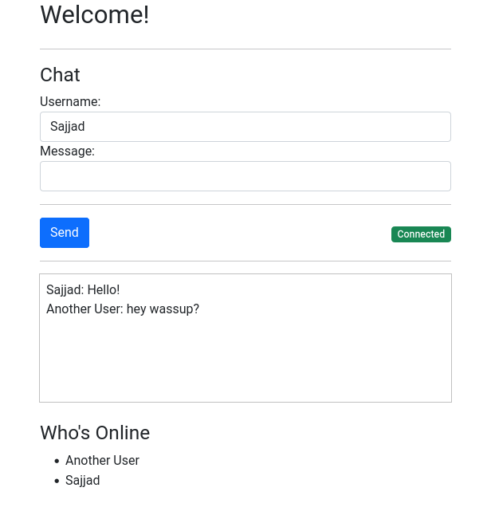

# ws-chat
## chat application using WebSocket in Golang

### Used packages:
#### Go:
- [Gorilla WebSocket](https://github.com/gorilla/websocket)
- [Pat](https://github.com/bmizerany/pat)
- [Jet](https://github.com/CloudyKit/jet/)
#### JS:
- [notie](https://github.com/jaredreich/notie)
- [ReconnectingWebSocket](https://github.com/joewalnes/reconnecting-websocket)

### ScreenShot

